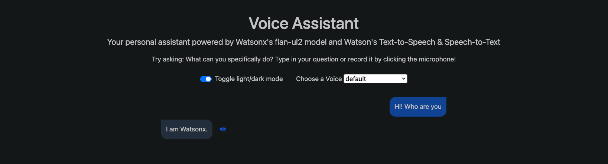

# Watsonx-Voice-Translation-Assistant



## 🌟 Overview

This project is a sophisticated **Voice-to-Voice AI Translation Assistant** built to demonstrate how Generative AI can bridge communication gaps. It uses **IBM Watsonx.ai** (powered by the Mistral-Large model) to process and translate speech in real-time. While currently configured for English-to-Spanish translation, the architecture is designed with **Healthcare AI** in mind—providing a foundation for tools that can help doctors and patients communicate across language barriers.

## 🚀 Features

- **Speech-to-Text (STT):** Converts live vocal input into digital text using Watson STT.
- **Neural Translation:** Leverages **Mistral-Medium** via Watsonx for high-context, accurate translations.
- **Text-to-Speech (TTS):** Synthesizes the translated text into natural-sounding speech.
- **Modern Interface:** A responsive web UI built with Flask, Bootstrap, and JavaScript.

## 🛠️ Tech Stack

- **Backend:** Python / Flask
- **AI Models:** IBM Watsonx (Mistral-Medium-2505)
- **APIs:** Watson Speech-to-Text, Watson Text-to-Speech
- **Frontend:** HTML5, CSS3 (Keyframe animations), JavaScript, jQuery

## 📂 Project Structure

- `server.py`: The Flask "Nervous System" handling API routes and coordination.
- `worker.py`: The "Brain" containing the logic for LLM processing and Speech-to-Text/Text-to-Speech integration.
- `index.html` / `script.js`: The "Face" of the application providing a seamless user experience.

## 🔧 Setup & Installation

1. **Clone the Repo:**
   ```bash
   git clone https://github.com/Nauman123-coder/Watsonx-Voice-Translation-Assistant.git
   cd Watsonx-Voice-Translation-Assistant
